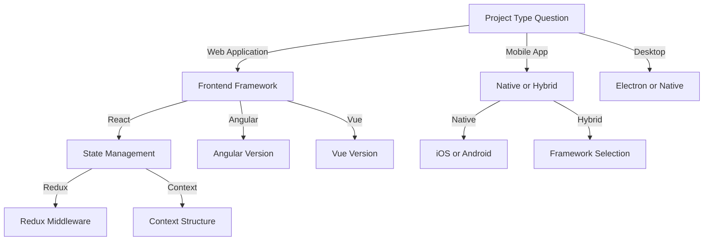
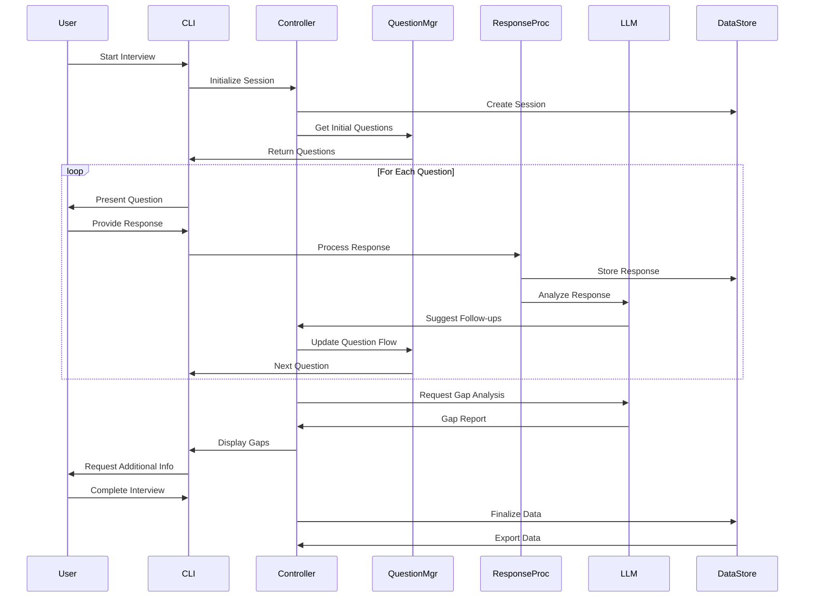

# Interview System Design

Version: 1.0.0  
Last Updated: 2025-03-05  
Status: Proposed

## System Purpose

The Interview System is a critical component of the Documentation Template System that guides users through a structured interview process to gather project information. This system uses LLM intelligence to adapt questions based on context, provide recommendations, and ensure comprehensive information collection.

## System Requirements

1. **Functionality Requirements**
   - Guide users through a multi-stage interview process
   - Adapt questions based on previous answers
   - Provide technology recommendations
   - Generate follow-up questions for incomplete information
   - Export collected information to template engine

2. **Technical Requirements**
   - Command-line interface with interactive prompts
   - LLM API integration
   - JSON/YAML data storage
   - Graceful error handling
   - Session persistence (ability to pause/resume)

3. **Performance Requirements**
   - Response time <2 seconds for each question
   - Complete basic interview in <10 minutes
   - Scalable to handle complex project definitions

4. **Usability Requirements**
   - Clear, concise questions
   - Helpful examples for each question
   - Progress indication
   - Ability to revise previous answers

## System Architecture

### Component Overview

```
                  ┌─────────────────┐
                  │  CLI Interface  │
                  └────────┬────────┘
                           │
                  ┌────────┴────────┐
                  │  Interview      │
                  │  Controller     │
                  └────────┬────────┘
                           │
        ┌──────────────────┼──────────────────┐
        │                  │                  │
┌───────┴───────┐  ┌───────┴───────┐  ┌───────┴───────┐
│ Question      │  │ Response      │  │ LLM           │
│ Manager       │  │ Processor     │  │ Integration   │
└───────┬───────┘  └───────┬───────┘  └───────┬───────┘
        │                  │                  │
        │          ┌───────┴───────┐          │
        │          │ Data Store    │          │
        └──────────┤               ├──────────┘
                   └───────────────┘
```

### Component Descriptions

1. **CLI Interface**
   - Presents questions to the user
   - Captures responses
   - Displays progress and guidance
   - Provides command options (back, skip, help, exit, save)

2. **Interview Controller**
   - Manages the overall interview flow
   - Determines question sequencing
   - Tracks completion status
   - Handles session persistence

3. **Question Manager**
   - Loads question templates from configuration
   - Customizes questions based on context
   - Determines required vs. optional questions
   - Manages question dependencies

4. **Response Processor**
   - Validates user responses
   - Identifies incomplete or inconsistent answers
   - Transforms responses for storage
   - Extracts keywords for context building

5. **LLM Integration**
   - Enhances questions with context
   - Generates follow-up questions
   - Provides technology recommendations
   - Identifies gaps in collected information

6. **Data Store**
   - Persists interview session state
   - Stores collected responses
   - Maintains context information
   - Prepares data for template engine

## Interview Flow

### 1. Initial Context Gathering

Collects essential information to establish the project context:

- Project name and brief description
- Project type (Web, Mobile, Desktop, API, etc.)
- Primary business domain
- Project scale and timeline
- Key stakeholders

### 2. Technology Stack Recommendation

Uses the initial context to recommend appropriate technologies:

- Frontend framework options
- Backend technology options
- Database options
- Infrastructure considerations
- Development tool recommendations

### 3. Detailed Requirements Elicitation

Expands on project details based on context and technology choices:

- Functional requirements
- Performance requirements
- Security requirements
- Compliance requirements
- User experience expectations

### 4. Implementation Planning

Gathers information on development approach and timeline:

- Development methodology
- Team structure and roles
- Major milestones and deadlines
- Testing approach
- Deployment strategy

### 5. Validation and Enhancement

Reviews collected information and identifies gaps:

- Presents summary of collected information
- Highlights potential inconsistencies
- Suggests additional considerations
- Allows revision of previous answers

### 6. Documentation Selection

Determines which documentation artifacts should be generated:

- Required documents based on project type
- Optional documents based on organizational needs
- Customization options for each document
- Document prioritization

## Question Management

### Question Categories

Questions are organized into categories to ensure comprehensive coverage:

1. **Project Context**: Basic project information and goals
2. **Technical Requirements**: Functional and non-functional requirements
3. **Technology Stack**: Framework and tool selections
4. **Implementation Approach**: Development methodology and process
5. **Timeline & Resources**: Schedule, budget, and team composition
6. **Risk Management**: Potential issues and mitigation strategies
7. **Compliance & Governance**: Regulatory and organizational requirements

### Question Types

The system supports various question types to capture different kinds of information:

1. **Text Input**: Free-form text responses
2. **Multiple Choice**: Selection from predefined options
3. **Boolean**: Yes/No questions
4. **Scale**: Numerical rating (e.g., 1-5)
5. **List**: Collection of related items
6. **Matrix**: Two-dimensional data collection
7. **Hierarchical**: Nested information capture

### Question Dependencies

Questions are dynamically included or excluded based on:

1. **Previous Answers**: Only show relevant follow-up questions
2. **Project Type**: Different questions for web vs. mobile projects
3. **Technology Choices**: Framework-specific questions
4. **Compliance Requirements**: Additional questions for regulated industries

### Example Question Flow



## LLM Integration

### LLM Capabilities

The system uses LLMs for the following capabilities:

1. **Question Enhancement**: Improving clarity and relevance of questions
2. **Response Analysis**: Identifying gaps or inconsistencies in answers
3. **Recommendation Generation**: Suggesting appropriate technologies
4. **Follow-up Question Creation**: Dynamically generating follow-up questions
5. **Content Summarization**: Creating concise summaries of collected information

### Prompt Design

LLM prompts are structured to ensure high-quality results:

1. **Context Inclusion**: Providing relevant project context
2. **Task Specification**: Clear instructions on the required output
3. **Format Definition**: Specifying the expected response format
4. **Example Provision**: Including examples of desired outputs
5. **Constraint Definition**: Specifying limitations and requirements

### Example Prompts

#### Technology Recommendation Prompt

```
You are assisting with technology recommendations for a software project. Based on the following project information, recommend appropriate technology options with brief justifications:

Project Type: {{project_type}}
Project Description: {{project_description}}
Key Requirements:
{{requirements_list}}
Performance Needs:
{{performance_needs}}
Team Experience:
{{team_experience}}

Please provide recommendations in the following format:
1. Frontend: [options with pros/cons]
2. Backend: [options with pros/cons]
3. Database: [options with pros/cons]
4. Infrastructure: [options with pros/cons]

For each category, provide 2-3 options highlighting which is most suitable and why.
```

#### Follow-up Question Generation

```
Based on the user's response to the question "{{question}}", generate 1-3 follow-up questions to gather more detailed information. The user's response was:

"{{response}}"

Project context:
{{project_context}}

Generate questions that:
1. Clarify ambiguous points
2. Explore important details that weren't mentioned
3. Validate assumptions

Format each question with a brief explanation of why you're asking it.
```

## Data Management

### Data Structures

The system uses the following data structures:

1. **Project Context Object**: Core project information
   ```json
   {
     "project_name": "String",
     "project_type": "Enum",
     "project_description": "String",
     "business_domain": "String",
     "project_scale": "Enum",
     "timeline": "Object",
     "stakeholders": "Array"
   }
   ```

2. **Question Template**: Definition of interview questions
   ```json
   {
     "id": "String",
     "category": "String",
     "question_text": "String",
     "help_text": "String",
     "question_type": "Enum",
     "options": "Array",
     "dependencies": "Object",
     "required": "Boolean",
     "validation": "Object"
   }
   ```

3. **Interview Session**: State of the interview process
   ```json
   {
     "session_id": "String",
     "start_time": "DateTime",
     "last_updated": "DateTime",
     "current_question": "String",
     "completed_questions": "Array",
     "responses": "Object",
     "context": "Object"
   }
   ```

4. **Documentation Plan**: Selected documentation artifacts
   ```json
   {
     "required_documents": "Array",
     "optional_documents": "Array",
     "custom_documents": "Array",
     "document_preferences": "Object"
   }
   ```

### Data Flow



## Implementation Approach

### Technology Stack

1. **Core Implementation**:
   - Node.js for runtime environment
   - Commander.js for CLI framework
   - Inquirer.js for interactive prompts
   - OpenAI/Anthropic SDK for LLM integration
   - Handlebars for template processing

2. **Data Management**:
   - JSON/YAML for configuration storage
   - Lowdb or similar for lightweight data persistence
   - Joi or Yup for data validation

3. **User Experience**:
   - Chalk for colorized output
   - Ora for spinners and loading indicators
   - CLI-table for formatted data display
   - Boxen for styled message boxes

### Development Phases

1. **Phase 1: Core Framework**
   - Basic CLI setup
   - Question loading and presentation
   - Response capture and validation
   - Session persistence

2. **Phase 2: Intelligence Integration**
   - LLM API integration
   - Dynamic question flow
   - Technology recommendation
   - Gap analysis

3. **Phase 3: Enhanced Experience**
   - Improved UI/UX
   - Progress visualization
   - Response revision capability
   - Help system

4. **Phase 4: Integration & Testing**
   - Template engine integration
   - Configuration management
   - Comprehensive testing
   - Documentation

### Testing Strategy

1. **Unit Testing**
   - Question manager logic
   - Response processor validation
   - Data transformations
   - LLM prompt construction

2. **Integration Testing**
   - CLI to controller integration
   - LLM API interaction
   - Data persistence
   - Template generation

3. **User Experience Testing**
   - Question clarity and flow
   - Error handling and recovery
   - Performance and responsiveness
   - Completion time metrics

## Extensibility

The system is designed to be extensible in the following ways:

1. **New Question Types**: Add new question formats without modifying core logic
2. **Custom Validation Rules**: Define project-specific validation requirements
3. **Additional LLM Capabilities**: Integrate new AI features as they become available
4. **Alternative UI Options**: Support web or GUI interfaces in addition to CLI
5. **Template Customization**: Add or modify document templates
6. **Integration Points**: Connect with external systems (JIRA, GitHub, etc.)

## Conclusion

The Interview System provides an intelligent, adaptive interface for gathering comprehensive project information. By combining structured questions with LLM-powered analysis and recommendations, it ensures that all necessary information is collected for generating high-quality documentation while minimizing user effort.
