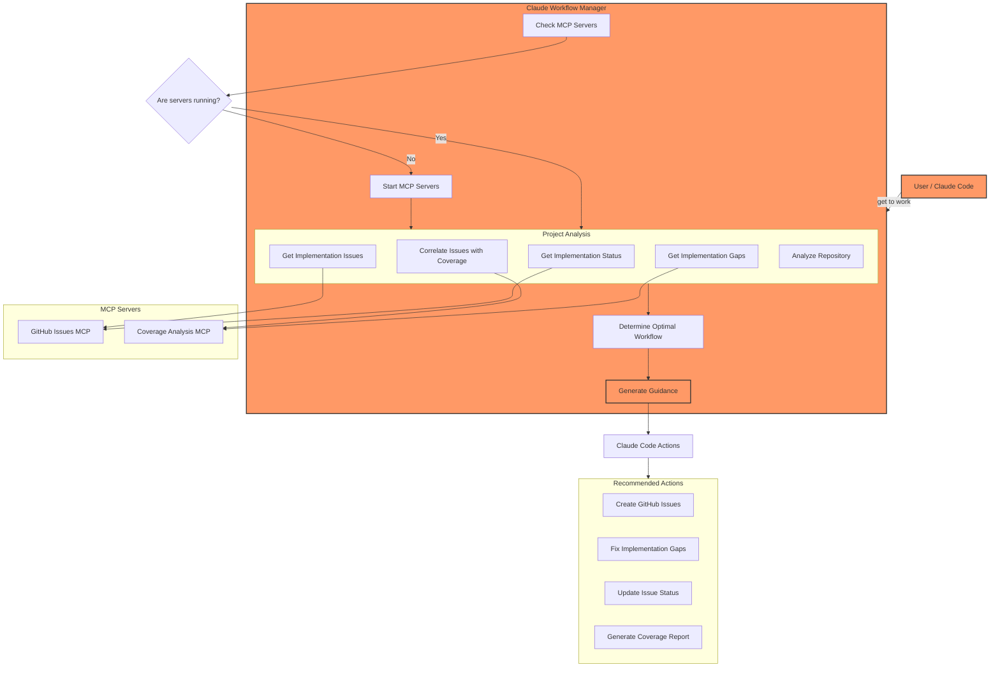

```mermaid
graph TB
    User[User / Claude Code] -- "get to work" --> Workflow
    
    subgraph Workflow[Claude Workflow Manager]
        Check[Check MCP Servers]
        Start[Start MCP Servers]
        Analysis[Analyze Project State]
        Determine[Determine Optimal Workflow]
        Guide[Generate Guidance]
    end
    
    Check --> IsRunning{Are servers running?}
    IsRunning -- No --> Start
    IsRunning -- Yes --> Analysis
    Start --> Analysis
    
    subgraph Analysis[Project Analysis]
        Status[Get Implementation Status]
        Gaps[Get Implementation Gaps]
        Issues[Get Implementation Issues]
        Correlate[Correlate Issues with Coverage]
        Repo[Analyze Repository]
    end
    
    Analysis --> Determine
    Determine --> Guide
    Guide --> Claude[Claude Code Actions]
    
    subgraph MCP[MCP Servers]
        GitHub_MCP[GitHub Issues MCP]
        Coverage_MCP[Coverage Analysis MCP]
    end
    
    Status --> GitHub_MCP
    Gaps --> Coverage_MCP
    Issues --> GitHub_MCP
    Correlate --> Coverage_MCP
    
    subgraph Actions[Recommended Actions]
        CreateIssues[Create GitHub Issues]
        FixGaps[Fix Implementation Gaps]
        UpdateIssues[Update Issue Status]
        GenerateReport[Generate Coverage Report]
    end
    
    Claude --> Actions
    
    classDef highlight fill:#f96,stroke:#333,stroke-width:2px;
    class User,Workflow,Guide highlight;
```