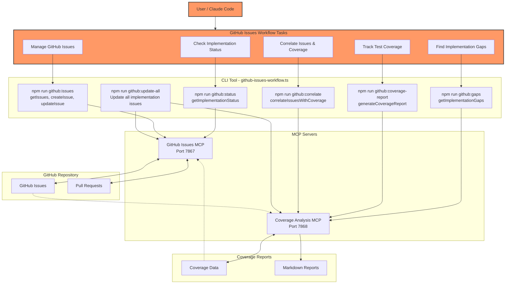

```mermaid
graph TB
    User[User / Claude Code] --> Tasks
    
    subgraph Tasks[GitHub Issues Workflow Tasks]
        Status[Check Implementation Status]
        Issues[Manage GitHub Issues]
        Gaps[Find Implementation Gaps]
        Coverage[Track Test Coverage]
        Correlate[Correlate Issues & Coverage]
    end
    
    subgraph CLI[CLI Tool - github-issues-workflow.ts]
        Status_CLI["npm run github:status\ngetImplementationStatus"]
        Issues_CLI["npm run github:issues\ngetIssues, createIssue, updateIssue"]
        Gaps_CLI["npm run github:gaps\ngetImplementationGaps"]
        Coverage_CLI["npm run github:coverage-report\ngenerateCoverageReport"]
        Correlate_CLI["npm run github:correlate\ncorrelateIssuesWithCoverage"]
        UpdateAll["npm run github:update-all\nUpdate all implementation issues"]
    end
    
    Status --> Status_CLI
    Issues --> Issues_CLI
    Gaps --> Gaps_CLI
    Coverage --> Coverage_CLI
    Correlate --> Correlate_CLI
    
    subgraph MCP[MCP Servers]
        GitHub_MCP[GitHub Issues MCP\nPort 7867]
        Coverage_MCP[Coverage Analysis MCP\nPort 7868]
    end
    
    Status_CLI --> GitHub_MCP
    Issues_CLI --> GitHub_MCP
    Gaps_CLI --> Coverage_MCP
    Coverage_CLI --> Coverage_MCP
    Correlate_CLI --> Coverage_MCP
    UpdateAll --> GitHub_MCP
    UpdateAll --> Coverage_MCP
    
    subgraph GitHub[GitHub Repository]
        GH_Issues[GitHub Issues]
        GH_PR[Pull Requests]
    end
    
    subgraph Reports[Coverage Reports]
        CoverageData[Coverage Data]
        ReportFiles[Markdown Reports]
    end
    
    GitHub_MCP <--> GH_Issues
    GitHub_MCP <--> GH_PR
    Coverage_MCP <--> CoverageData
    Coverage_MCP --> ReportFiles
    
    CoverageData -.-> GitHub_MCP
    GH_Issues -.-> Coverage_MCP
    
    classDef highlight fill:#f96,stroke:#333,stroke-width:2px;
    class User,Tasks highlight;
```