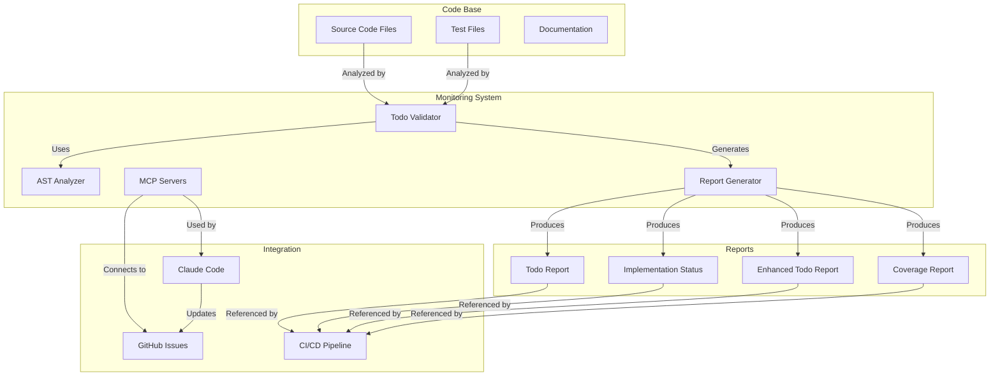

```mermaid
graph TD
    subgraph Code Base
        A[Source Code Files]
        B[Test Files]
        C[Documentation]
    end

    subgraph Monitoring System
        D[Todo Validator]
        E[AST Analyzer]
        F[Report Generator]
        G[MCP Servers]
    end

    subgraph Reports
        H[Todo Report]
        I[Enhanced Todo Report]
        J[Implementation Status]
        K[Coverage Report]
    end

    subgraph Integration
        L[GitHub Issues]
        M[Claude Code]
        N[CI/CD Pipeline]
    end

    A -->|Analyzed by| D
    B -->|Analyzed by| D
    D -->|Uses| E
    D -->|Generates| F
    F -->|Produces| H
    F -->|Produces| I
    F -->|Produces| J
    F -->|Produces| K
    G -->|Connects to| L
    G -->|Used by| M
    M -->|Updates| L
    H -->|Referenced by| N
    J -->|Referenced by| N
    I -->|Referenced by| N
    K -->|Referenced by| N
```