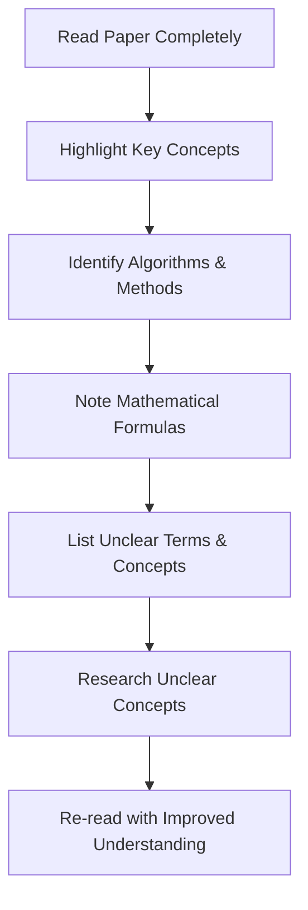

# Implementation Workflow for Academic Papers

## Overview

This document outlines a structured workflow for implementing academic papers as software. The workflow is designed to maintain fidelity to the original research while producing efficient, maintainable code. This bottom-up, incremental approach is particularly effective for complex papers that might otherwise be overwhelming to implement.

## Workflow Phases

The implementation workflow consists of five main phases:

1. **Understanding**: Gain deep understanding of the paper's concepts
2. **Modeling**: Create structured representations of the paper's components
3. **Planning**: Develop an incremental implementation strategy
4. **Implementation**: Build the software following the plan
5. **Verification**: Validate implementation fidelity to the original paper

## Phase 1: Understanding

### 1.1 Initial Review



#### Practical Steps

1. **Read Without Implementation in Mind** (first pass)
   - Focus on understanding the overall purpose and contributions
   - Don't worry about implementation details yet

2. **Identify Core Components**
   - Algorithms: Named or numbered algorithms in the paper
   - Methods: Specific techniques described
   - Data Structures: Data organization approaches
   - Parameters: Key constants or thresholds

3. **Research Prerequisites**
   - Identify and study cited papers for critical concepts
   - Research unfamiliar terms or techniques

### 1.2 Conceptual Mapping

Create a conceptual map of the paper's components and their relationships:

```python
from docgen.paper_architect.understanding import ConceptMapper

# Initialize the concept mapper
mapper = ConceptMapper("paper.json")

# Generate concept map
concept_map = mapper.generate_concept_map()

# Visualize the concept map
mapper.visualize_concept_map("concept_map.html")

# Export as structured data
mapper.export_concept_map("concept_map.json")
```

The concept map should identify:
- Key concepts and their definitions
- Relationships between concepts
- Dependencies between components
- Inputs and outputs of algorithms

## Phase 2: Modeling

### 2.1 Paper Structure Analysis

```python
from docgen.paper_architect.modeling import PaperStructureAnalyzer

# Analyze paper structure
analyzer = PaperStructureAnalyzer("paper.json")
structure = analyzer.analyze()

# Print section hierarchy
structure.print_section_hierarchy()

# Identify key components
algorithms = structure.extract_algorithms()
methods = structure.extract_methods()
equations = structure.extract_equations()
parameters = structure.extract_parameters()

# Generate structure report
report = structure.generate_report()
with open("paper_structure.md", "w") as f:
    f.write(report)
```

### 2.2 Algorithm Modeling

For each algorithm in the paper:

1. **Define Inputs and Outputs**
   - Data types and structures
   - Valid ranges and constraints
   - Expected dimensionality

2. **Break Down Steps**
   - Identify sequential steps in the algorithm
   - Note any conditional logic or branches
   - Identify loops and recursion

3. **Identify Dependencies**
   - External libraries or frameworks needed
   - Prerequisites from other paper components

4. **Model in Pseudo-code**
   - Create language-agnostic pseudo-code
   - Match paper's notation where possible
   - Document unclear aspects for later resolution

```python
from docgen.paper_architect.modeling import AlgorithmModeler

# Model a specific algorithm
modeler = AlgorithmModeler()
algorithm = modeler.model_algorithm(
    name="KnowledgeGraphExpansion",
    inputs=[
        {"name": "base_graph", "type": "NetworkX Graph"},
        {"name": "entity_embeddings", "type": "Dict[str, np.ndarray]"}
    ],
    outputs=[
        {"name": "expanded_graph", "type": "NetworkX Graph"}
    ],
    steps=[
        "Identify candidate relationships between entities",
        "Calculate similarity scores for candidates",
        "Filter candidates based on similarity threshold",
        "Add high-confidence relationships to graph"
    ],
    parameters={
        "SIMILARITY_THRESHOLD": 0.75,
        "MAX_PATH_LENGTH": 3
    }
)

# Generate algorithm document
algorithm_doc = modeler.generate_algorithm_document(algorithm)
with open("knowledge_graph_expansion_algorithm.md", "w") as f:
    f.write(algorithm_doc)
```

## Phase 3: Planning

### 3.1 Component Dependency Analysis

```python
from docgen.paper_architect.planning import DependencyAnalyzer

# Analyze dependencies
analyzer = DependencyAnalyzer("paper_model.json")
dependencies = analyzer.analyze_dependencies()

# Generate dependency graph
analyzer.generate_dependency_graph("dependency_graph.html")

# Determine optimal implementation order
implementation_order = analyzer.determine_implementation_order()
print("Suggested implementation order:")
for component in implementation_order:
    print(f"- {component['name']}")
```

### 3.2 Bottom-Up Implementation Plan

Create a staged implementation plan working from foundational components up:

1. **Foundation Layer**
   - Basic data structures
   - Utility functions
   - External library wrappers

2. **Core Algorithm Layer**
   - Key algorithms without optimizations
   - Basic method implementations

3. **Integration Layer**
   - Component connections
   - Data flow between algorithms

4. **Optimization Layer**
   - Performance enhancements
   - Special case handling

5. **Evaluation Layer**
   - Metrics and evaluation methods
   - Comparison with paper results

```python
from docgen.paper_architect.planning import ImplementationPlanner

# Create implementation plan
planner = ImplementationPlanner("paper_model.json")
plan = planner.create_implementation_plan()

# Generate plan document
plan_doc = planner.generate_plan_document()
with open("implementation_plan.md", "w") as f:
    f.write(plan_doc)

# Generate stage-specific task lists
for stage in plan['stages']:
    tasks = planner.generate_stage_tasks(stage['name'])
    with open(f"{stage['name']}_tasks.md", "w") as f:
        f.write(tasks)
```

### 3.3 Verification Strategy

Develop a strategy for verifying implementation fidelity:

1. **Unit Tests**
   - Test individual algorithms
   - Verify mathematical correctness
   - Check edge cases

2. **Integration Tests**
   - Verify component interactions
   - Test end-to-end workflows

3. **Validation Tests**
   - Compare results with paper examples
   - Replicate experiments from the paper
   - Verify performance metrics

```python
from docgen.paper_architect.planning import VerificationPlanner

# Create verification plan
planner = VerificationPlanner("paper_model.json")
verification_plan = planner.create_verification_plan()

# Generate verification document
verification_doc = planner.generate_verification_document()
with open("verification_plan.md", "w") as f:
    f.write(verification_doc)
```

## Phase 4: Implementation

### 4.1 Environment Setup

```python
from docgen.paper_architect.implementation import EnvironmentSetup

# Setup implementation environment
setup = EnvironmentSetup()
setup.create_project_structure("knowledge_graph_expander")
setup.generate_requirements_file()
setup.initialize_git_repository()
setup.create_readme()
```

### 4.2 Foundation Implementation

For each foundation component:

1. **Create Test First**
   - Define expected behavior
   - Create test fixtures

2. **Implement Component**
   - Follow paper description
   - Add detailed comments referencing the paper
   - Use paper's notation in variable names

3. **Verify Implementation**
   - Run tests to verify correctness
   - Compare with paper examples

```python
from docgen.paper_architect.implementation import ComponentImplementer

# Implement a foundation component
implementer = ComponentImplementer()
implementer.implement_component(
    name="entity_similarity",
    description="Calculate semantic similarity between entities",
    paper_reference="Section 3.2, Equation 4",
    test_fixtures=[
        {"input": {"e1": "entity1", "e2": "entity2"}, "expected": 0.85}
    ]
)
```

### 4.3 Incremental Implementation

Follow the implementation plan, working from foundation to advanced components:

```python
from docgen.paper_architect.implementation import ImplementationTracker

# Track implementation progress
tracker = ImplementationTracker("implementation_plan.json")

# Implement current stage components
current_stage = tracker.get_current_stage()
components = tracker.get_stage_components(current_stage)

for component in components:
    # Mark component as in progress
    tracker.update_component_status(component['name'], "In Progress")
    
    # Implement the component
    # ...implementation code...
    
    # Run component tests
    # ...testing code...
    
    # Update status
    tracker.update_component_status(component['name'], "Implemented")

# Check if stage is complete
if tracker.is_stage_complete(current_stage):
    tracker.advance_to_next_stage()
```

### 4.4 Documentation

Document the implementation with references to the paper:

```python
from docgen.paper_architect.implementation import DocumentationGenerator

# Generate implementation documentation
generator = DocumentationGenerator("paper_model.json", "src/")
documentation = generator.generate_documentation()

# Create documentation files
generator.write_documentation("docs/")
```

## Phase 5: Verification

### 5.1 Unit Testing

Verify that individual components work correctly:

```python
from docgen.paper_architect.verification import UnitTestRunner

# Run unit tests
runner = UnitTestRunner("tests/unit/")
results = runner.run_tests()

# Generate test report
report = runner.generate_report()
with open("unit_test_report.md", "w") as f:
    f.write(report)
```

### 5.2 Paper Experiment Replication

Replicate experiments from the paper to verify overall implementation:

```python
from docgen.paper_architect.verification import ExperimentReplicator

# Define experiment from paper
replicator = ExperimentReplicator()
experiment = replicator.define_experiment(
    name="EntityLinkingExperiment",
    description="Replicate entity linking experiment from Section 5.2",
    datasets=["dataset1", "dataset2"],
    metrics=["precision", "recall", "f1_score"],
    expected_results={
        "dataset1": {"precision": 0.82, "recall": 0.79, "f1_score": 0.80},
        "dataset2": {"precision": 0.78, "recall": 0.75, "f1_score": 0.76}
    },
    tolerance=0.02  # Allow 2% deviation from paper results
)

# Run the experiment
results = replicator.run_experiment(experiment)

# Generate experiment report
report = replicator.generate_report(experiment, results)
with open("experiment_report.md", "w") as f:
    f.write(report)
```

### 5.3 Implementation Fidelity Analysis

Analyze how closely the implementation follows the paper:

```python
from docgen.paper_architect.verification import FidelityAnalyzer

# Analyze implementation fidelity
analyzer = FidelityAnalyzer("paper_model.json", "src/")
fidelity = analyzer.analyze_fidelity()

# Generate fidelity report
report = analyzer.generate_report()
with open("fidelity_report.md", "w") as f:
    f.write(report)
```

## Challenges and Solutions

### Implementing Unclear Sections

When the paper has unclear or ambiguous descriptions:

1. **Check Referenced Papers**
   - Often details are in cited works
   - Look for alternative explanations

2. **Contact Authors**
   - Email authors with specific questions
   - Check if authors have released code

3. **Implement Multiple Versions**
   - Create different interpretations
   - Test each against examples
   - Select the best performing version

### Handling Missing Details

When implementation details are missing:

1. **Make Reasonable Assumptions**
   - Document assumptions clearly
   - Base assumptions on domain knowledge

2. **Implement Configurable Options**
   - Allow configuration of unclear parameters
   - Provide sensible defaults

3. **Ablation Testing**
   - Test different configurations
   - Determine impact on results

### Mid-Implementation Architecture Changes

When architectural changes are needed mid-implementation:

1. **Maintain Paper Fidelity**
   - Preserve algorithm logic during refactoring
   - Verify behavior before and after changes

2. **Incremental Migration**
   - Migrate one component at a time
   - Verify each component after migration

3. **Double Implementation**
   - Implement new architecture in parallel
   - Verify both implementations against the paper
   - Transition when new architecture is verified

## Using with Claude Code

Claude Code can assist with each phase of the implementation workflow:

### Understanding Phase

```
I'm implementing a research paper on knowledge graph expansion. Help me understand the following concept from Section 3.2:

[Paste paper excerpt]

Please explain:
1. What this algorithm is doing in simple terms
2. The key inputs and outputs
3. Any prerequisite knowledge I should have
```

### Modeling Phase

```
Help me model the algorithm described in Section 4.1 of this paper:

[Paste algorithm description]

Please create:
1. A list of inputs and outputs with their types
2. A step-by-step breakdown of the algorithm
3. Any constants or parameters needed
4. Pseudocode that matches the paper description
```

### Planning Phase

```
I've analyzed the dependencies between components in this paper. Here's my implementation plan:

[Paste dependency analysis]

Please help me:
1. Determine the optimal implementation order
2. Identify any potential challenges in each component
3. Suggest a testing strategy for each component
4. Recommend any libraries or frameworks that might help
```

### Implementation Phase

```
I'm implementing the entity matching algorithm from Section 3.2 of the paper. Here's the specification:

[Paste algorithm specification]

Please help me:
1. Write Python code for this algorithm
2. Include detailed comments referencing the paper
3. Create test cases to verify correctness
4. Add appropriate paper references as code annotations
```

### Verification Phase

```
I've implemented the knowledge graph expansion algorithm from the paper. Here are the test results:

[Paste test results]

The paper reports an F1 score of 0.82, but I'm getting 0.78. Please help me:
1. Identify potential causes for the discrepancy
2. Suggest improvements to match the paper results
3. Create additional tests to pinpoint the issue
```

## Best Practices

1. **Start Small and Simple**
   - Begin with the simplest version of algorithms
   - Add complexity incrementally
   - Verify correctness at each step

2. **Focus on Paper Fidelity First**
   - Prioritize matching the paper exactly
   - Optimize only after correctness is verified
   - Document any deviations from the paper

3. **Document Extensively**
   - Reference paper sections in code comments
   - Explain reasoning for implementation choices
   - Note any unclear or ambiguous sections

4. **Use Version Control Effectively**
   - Create branches for different interpretations
   - Tag versions corresponding to paper sections
   - Use meaningful commit messages referencing the paper

5. **Validate Against Paper Results**
   - Replicate experiments exactly as described
   - Compare results using the same metrics
   - Investigate and document discrepancies

## Conclusion

Implementing academic papers requires a structured approach that emphasizes understanding, planning, and verification. By following this workflow, you can successfully transform complex research concepts into working software while maintaining fidelity to the original research.

The DocGen `paper_architect` module provides the tools and guidance needed to navigate this process, from initial paper analysis to final verification. Each component of the workflow is designed to address the specific challenges of academic paper implementation, ensuring that the resulting software accurately reflects the research concepts.